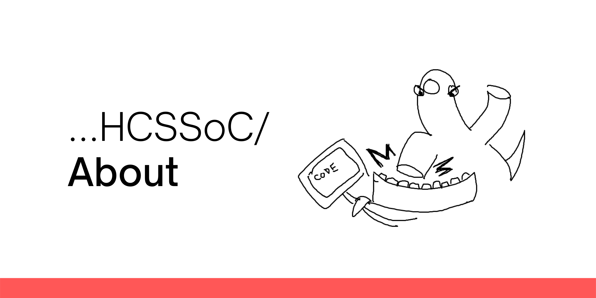
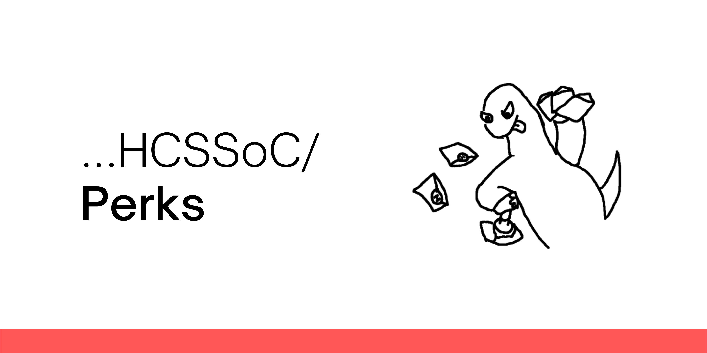
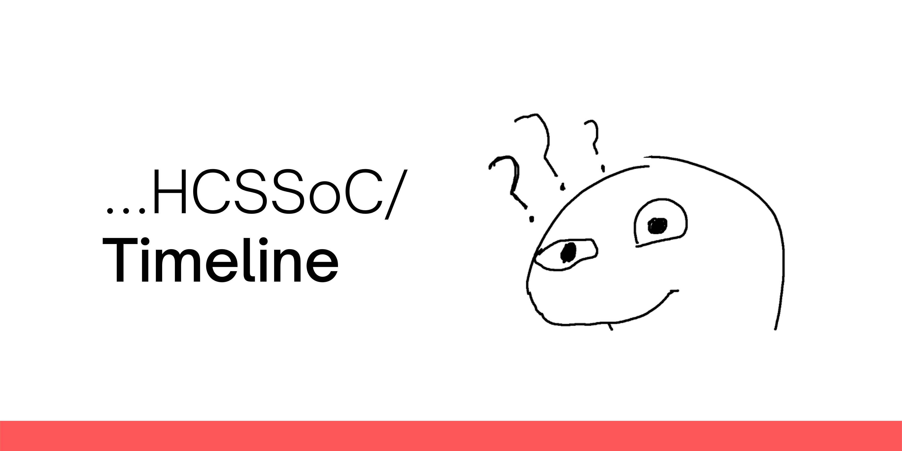
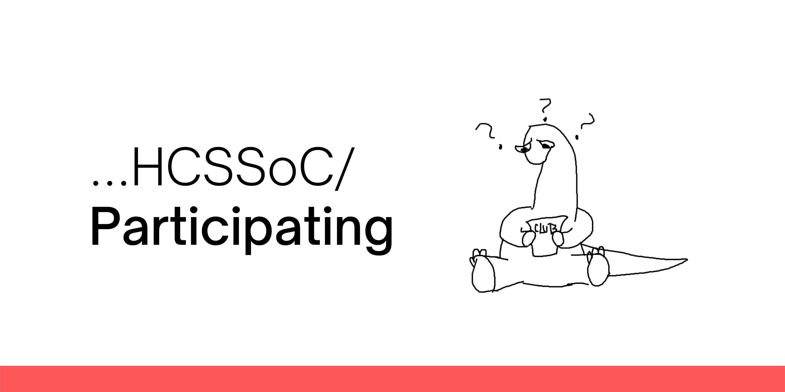
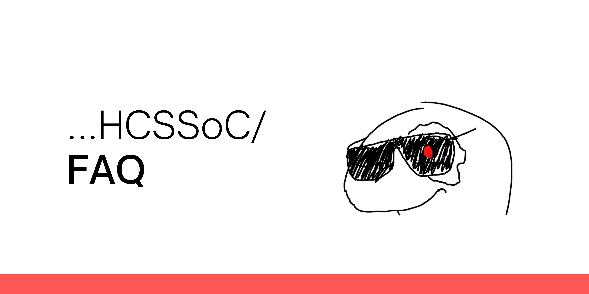
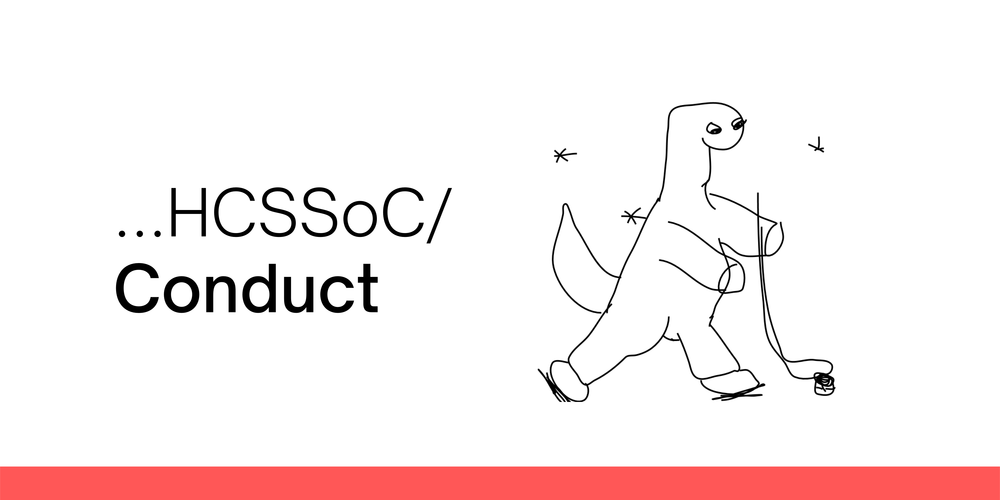

# Hack Club SRM Summer of Code
Are you a budding developer looking forward to jumping into the world of Open Source, and on the lookout for a prospective platform? 

Say no more, as Orpheus, the official mascot of Hack Club and the official Hack Club Community at SRM Institute of Science and Technology, Kattankulathur, bring forth the **HCSSoC**.

# About the Program
## "The power of Open Source is the power of people. The people rule."
Hack Club SRM Summer of Code aims at introducing young developers and students to Open Source Contribution. The initiative is backed by GitHub Education and focuses on helping developers be a better.

HCCSoC is going to be a month long journey commencing from 19th June, 2021, so gear up, plug in your keyboard and get ready to code with amazing mentors, ready to assist you at every step!

Like the Community of Hack Club SRM, HCSSoC is open for every individual enrolled at any educational institution as of 18th June, 2021. What does that mean -- no shortlisting!

# What HCSSoC Offers
## For Students
 - Interested students get the opportunity to learn and grow in the field of Open Source Development.
 - Participants get industrial exposure and experience, they can also possibly bag an internship opportunity at our partner organizations.
 - Students have the flexibility to contribute to at most 2 projects of their choice.
 - They receive the opportunity to be paired up with amazing mentors, many of them representing reputed organizations.
 - All students of SRM Institute of Science and Technology, Kattankulathur, will receive a Sticker Pack upon successful participation.
 - Two students per project (recognized by Hack Club SRM) with most number of contributions* will take home a schwag kit.

*NOTE: We do not count the quantity of commits or contributions but the quality of code.*

## For Mentors
 - Mentors get to connect with young developers and build connections.
 - All mentors who guide and encourage students participating in HCSSoC throughtout the program are eligible for schwag kits!

## For Organizations
 - Organizations participating in HCSSoC receive the opportunity to work with young minds and have them contribute to their codebase.
 - Organizations who are actively on the lookout for interns can consider our pool of prospective candidates.

# Timeline
| Date | Header | Description |
| ----- | -------- | -------- |
| 28th May | Project Application Starts | Mentors and Organizations start submitting their project proposals. |
| 9th June | Projects Announced | Projects shortlisted for HCSSoC will be announced. |
| 10th June | Student Application Starts | Students can start registering for at max 2 projects during this phase. |
| 19th June | Phase 1 | HCSSoC takes off and tasks are handed out to participants. |
| 29th June | Phase 2 | Post progress check, second round tasks are assigned. |
| 9th July | Phase 3 | Progress of the previous two phases is assessed and the documentation phase commences. |
| 19th July | Successful Students Announced | Students who have successfully completed HCSSoC will be acknowledged. |
| 23rd July | Top Contributors Announced | Participants recommended by mentors will be acknowledged. Certificates will be sent out to all. |

# Participating
TBA

# FAQ

<h3>Is participating in HCSSoC free?</h3>

Absolutely! All events organized by Hack Club SRM are proudly free of cost!

<h3>Will I get paid for participating?</h3>

No, however, we have amazing schwag kits, sticker packs and other rewards for our participants!

<h3>Can I submit more than one proposal?</h3>

We would recommend you to submit only one proposal so it's an easier and smoother experience for you, but we allow participants to be a part of at most 2 projects.

<h3>Can I participate both as a Mentor and as a Participant as well?</h3>

Unfortunately, the answer would be no. As a Mentor, we would want you to be readily available for queries that students might have and we doubt that it would be possible for you if you are also a student attendee.

# Code of Conduct
At Hack Club SRM Summer of Code, we'll be implementing the same Code of Conduct that we follow for the Community, available [here](https://github.com/Hack-Club-SRM/Code-of-Conduct).